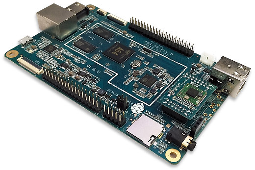

# Pine A64+ Custom Linux From Scratch

Pine A64+ is a arm64 SBC with a allWinner SOC, this repo aims to provide a comprehensive guide on building a custom Linux system for this board.

## The Problem

The Pine A64+ is a old but still powerful board, the support for the processor and the board is low, I'm using this repo to document my learning process in embedded linux.

## Getting Started

To get started, you'll need the following:

- Pine A64+ board
- Power supply
- MicroSD card (at least 8GB)
- Serial console cable (optional but recommended)
- A host computer running Linux
- 7" LCD Display (optional but recommended, I will try to add support to this device)

## Objectives

- Install the Toolchain
- Compile the Kernel
- Build the File System
- Build the Bootloader
- Boot the board (without changes)
- Add a dummy device to the device tree
- Add simple device (GPIO or LEDs)
- Add the 7" LCD display

# Terms

- **Device Tree Source (DTS)**: A description of the hardware components in a system and their configuration. It is used by the Linux kernel to manage and interface with the hardware.
- **System on Chip (SoC)**: An integrated circuit that consolidates all components of a computer or other electronic system into a single chip. It typically includes a CPU, memory, input/output ports, and secondary storage – all on a single substrate.
- **Single Board Computer (SBC)**: A complete computer built on a single circuit board, with microprocessor(s), memory, input/output (I/O), and other features required of a functional computer.
- **Bootloader**: A small program that loads the operating system into the computer's memory when the system is powered on.
- **Toolchain**: A set of programming tools used to create a software application. In the context of embedded systems, it typically includes a compiler, linker, and debugger.
- **Kernel**: The core part of an operating system, managing system resources and communication between hardware and software components.
- **File System**: A method and data structure that the operating system uses to control how data is stored and retrieved on a storage device.
- **GPIO (General-Purpose Input/Output)**: A generic pin on an integrated circuit whose behavior (including whether it is an input or output pin) can be controlled by the user at runtime.

# Thanks

[@mdaser](github.com/mdaser/pine64/)

# References

- [Pine64](https://www.pine64.org/)
- [AllWinner A64](https://linux-sunxi.org/A64)
- [Linux Kernel](https://www.kernel.org/)
- [BuildRoot](https://buildroot.org/)
- [Device Tree](https://www.devicetree.org/)
- [Manual build](https://wiki.amarulasolutions.com/bsp/sunxi/a64/pine.html)